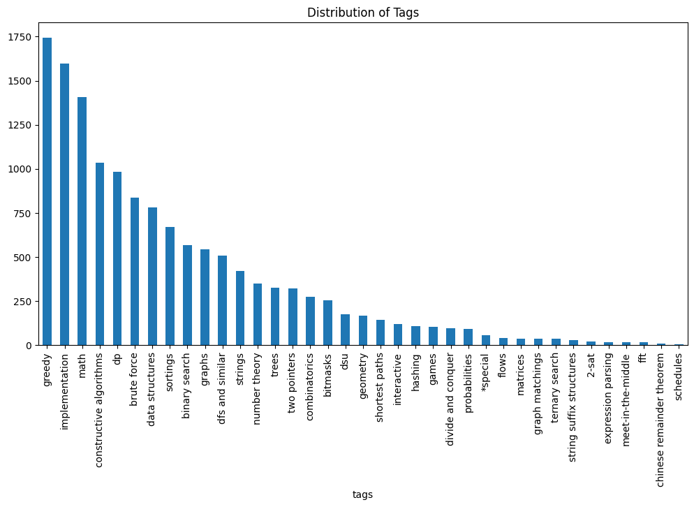
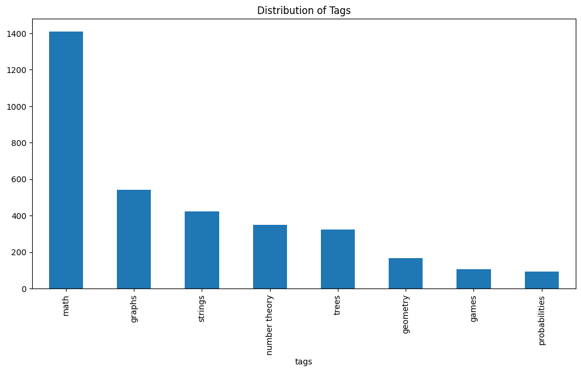
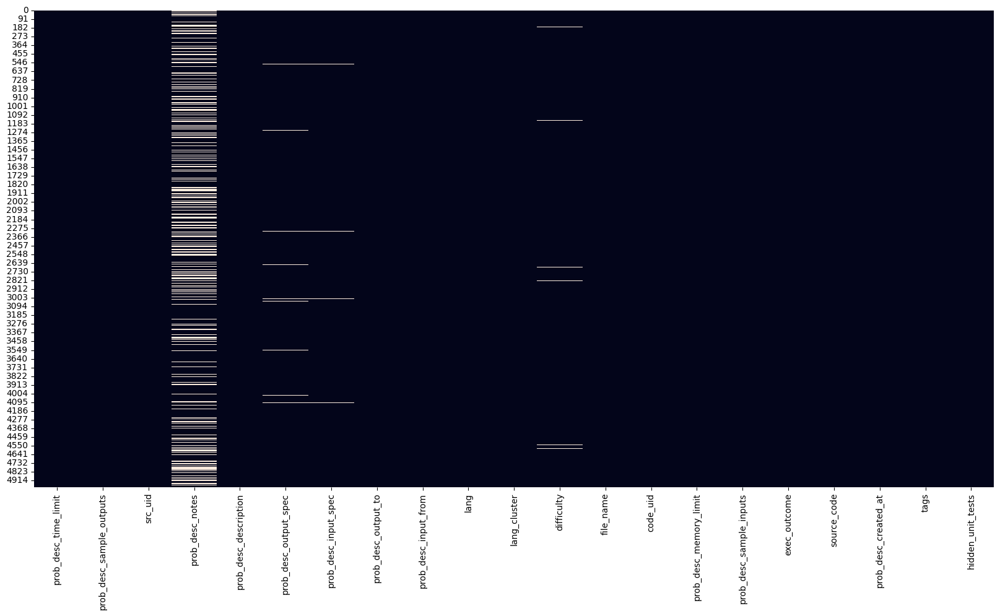
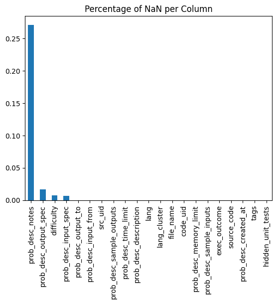
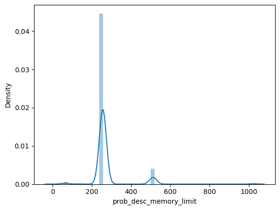
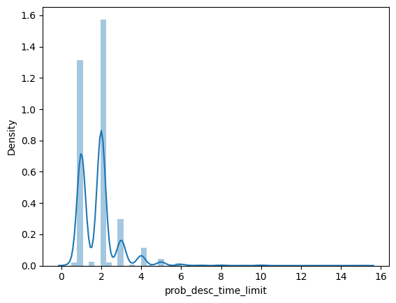
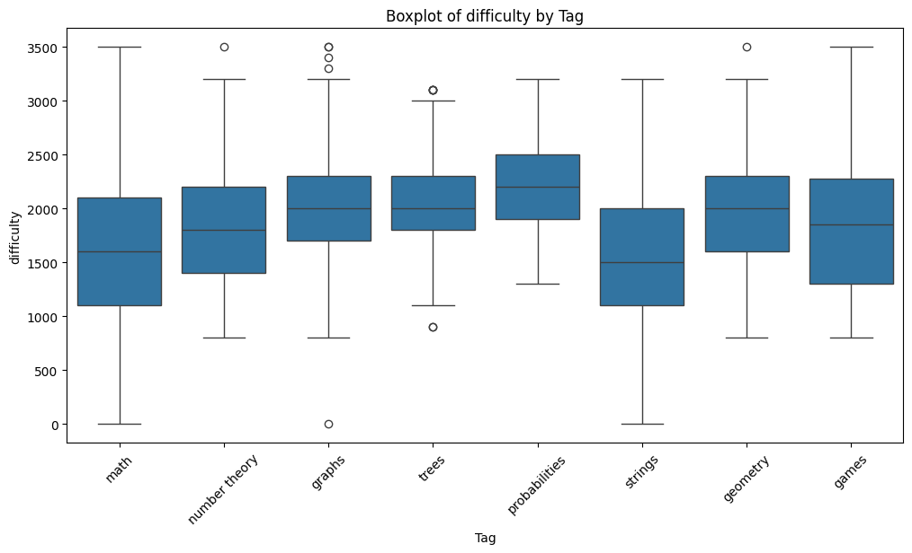
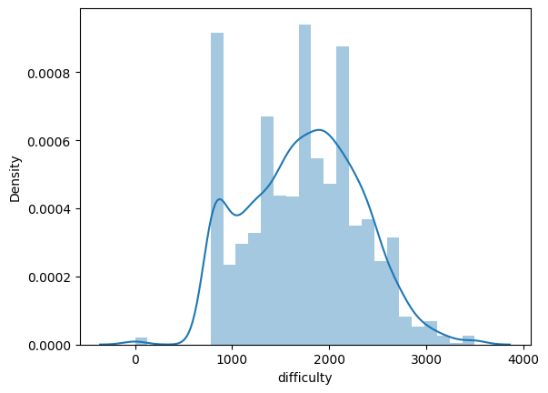

# Analyse de forme

- **Variable target :**
    - $T=38$ tags individuels, certains très fréquents (`greedy`, `implementation`, `math`)
    - 
    - Cardinalité des tags : 2.8
    - Densité des tags : 0.074
    - Diversité des tags : 1907 combinaisons distinctes, certaines très fréquentes (`[implementation]`, `[math]`, `[greedy]`)
    - Focus sur les tags principaux : **math, graphs, strings, number theory, trees, geometry, games, probabilities**
        - Cardinalité : 1.273
        - Densité : 0.159
        - Diversité : 77
    - 
- **Lignes et colonnes :** (4982, 21)
- **Types de variables :** 17 qualitatives, 3 quantitatives
- **Analyse des valeurs manquantes :**
    - `hidden_unit_tests` est toujours vide
    - `prob_desc_notes` : 27% de valeurs manquantes
    - Quelques valeurs manquantes pour `prob_desc_output_spec`, `prob_desc_input_spec`, `difficulty`
    - 
    - 

> **Remarque :** La stratégie Label Powerset n'est pas pertinente ici car seulement 30% des $2^8$ classes sont représentées, dont beaucoup de classes rares.

# Analyse de fond

- 
    - **On peut enlever la colonne `prob_desc_memory_limit`**
- 
- 
    - **On peut supprimer la colonne `prob_desc_time_limit`**

## Relations Variables / Target

- Dépendance entre tags et difficulty
    - 
    - 
- Les features `time_limit` et `memory_limit` ne sont pas significatives
- Relation entre variables textuelles et targets : 2 clusters mais tags mélangés
- **codeBERT** est mieux adapté que **TF-IDF** : les données sont mieux distribuées dans l'espace